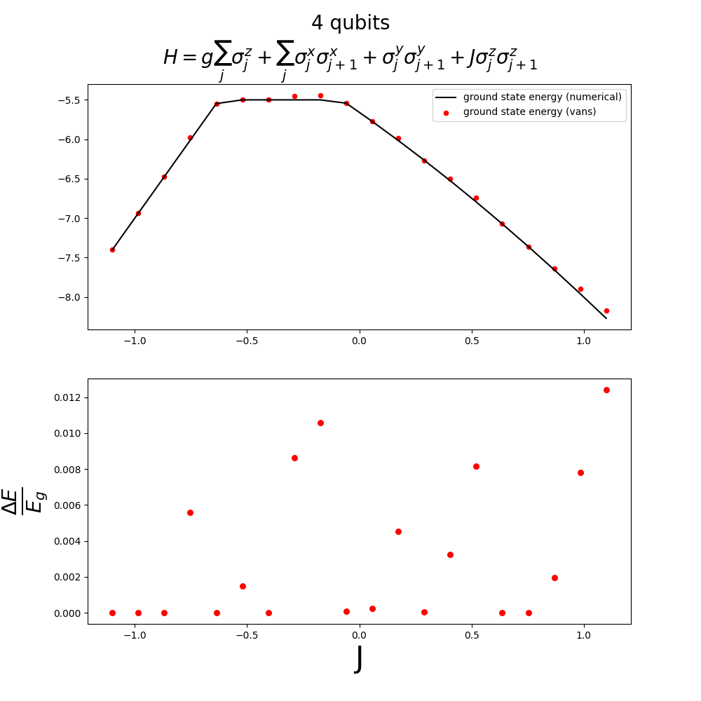
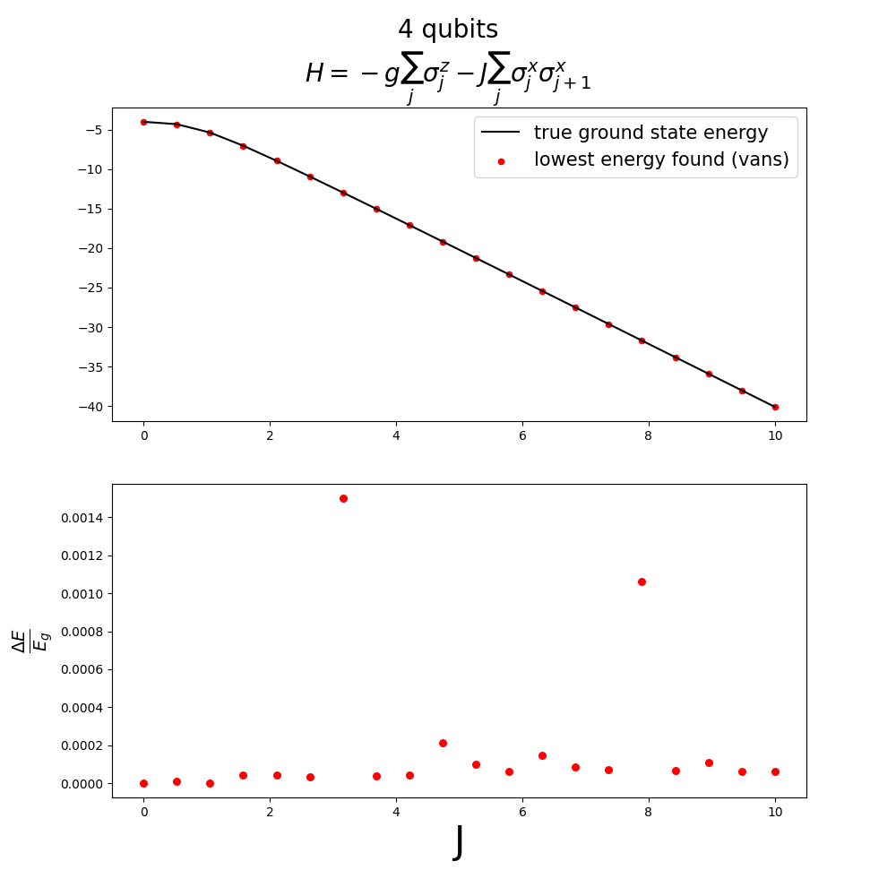
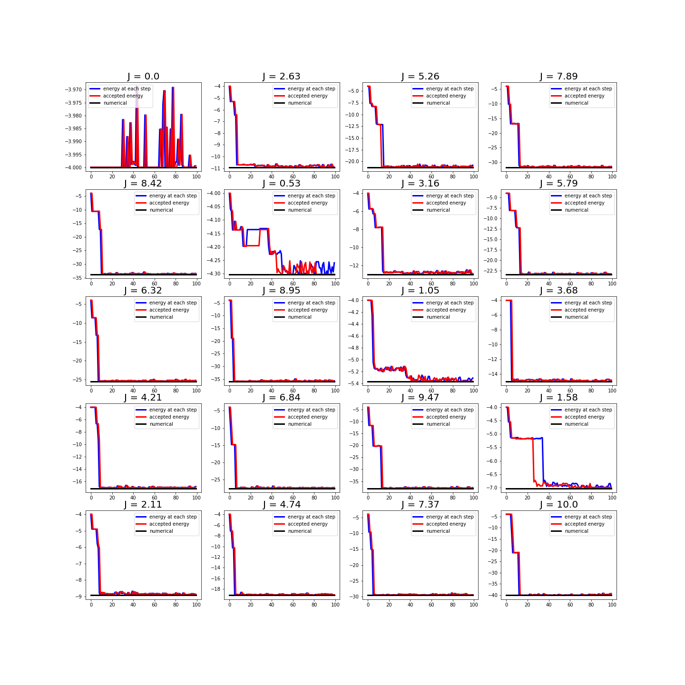
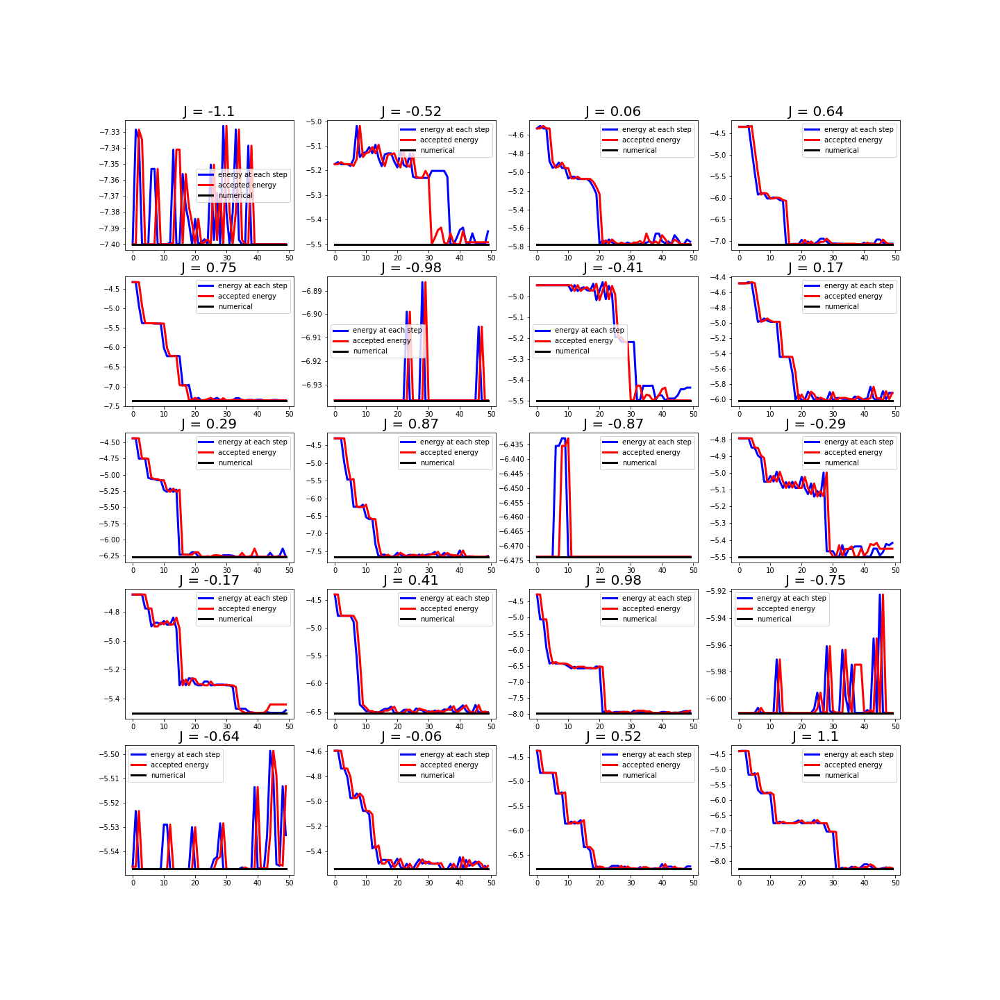
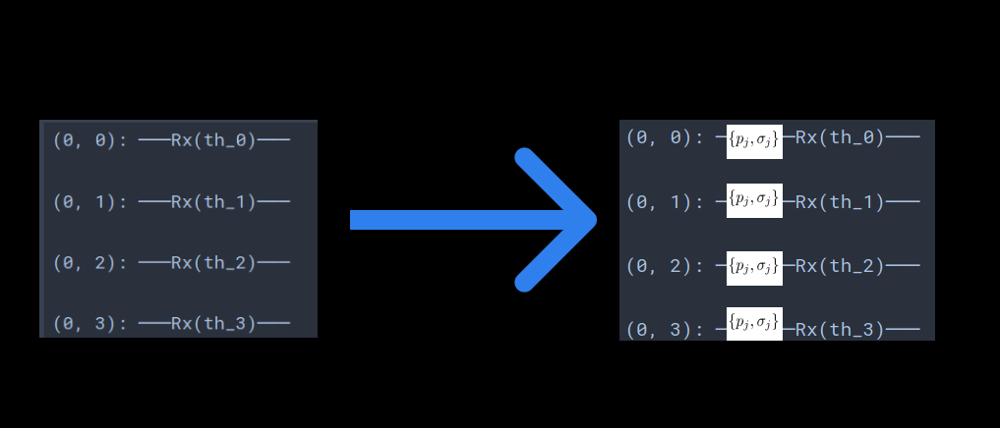
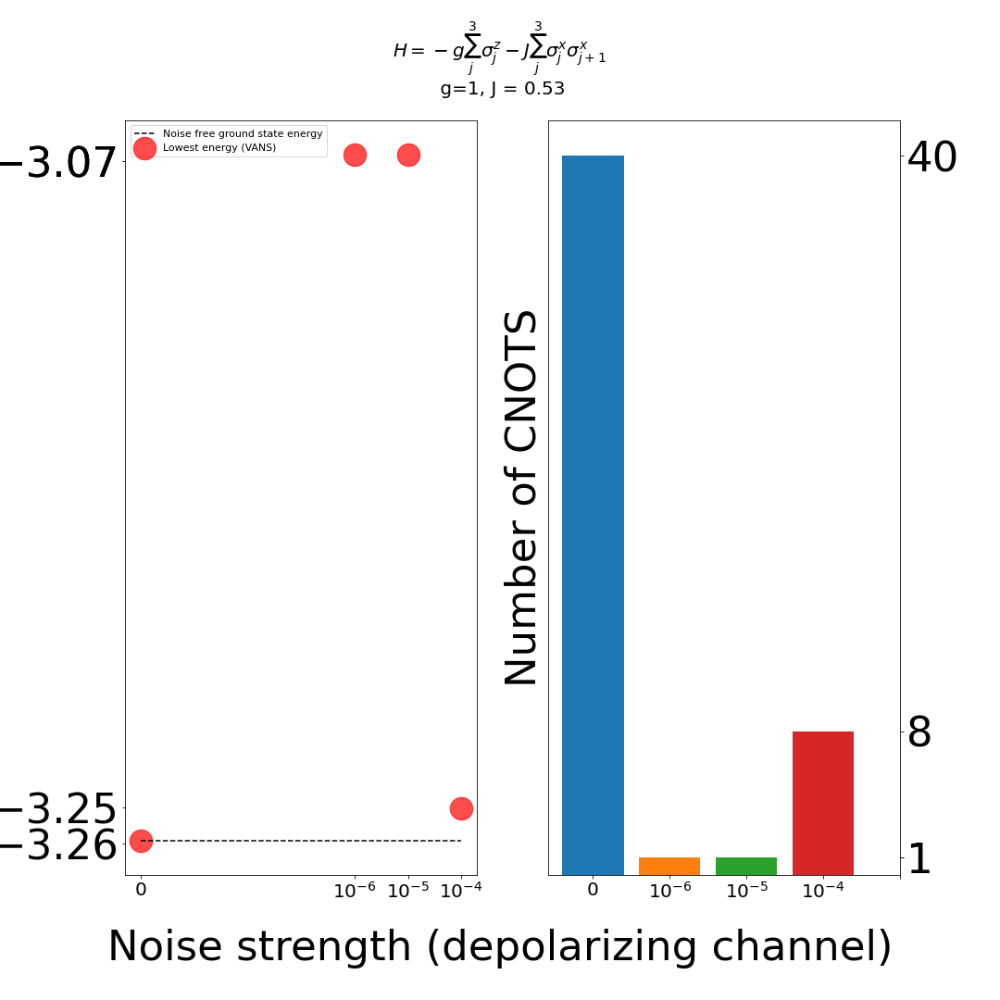

# VANS

We present VANS, an algorithm that uses a variable ansatz to do VQE. The way that the ansatz-searching is done will be described in the following, but essentially identity-resolution block of gates are proposed to be appended in the circuit, then VQE is run on the proposed circuit and if the obtained energy is lowered, the modification is accepted.

## Algorithm description

[To be done, but the file <i>main.py</i> is a good overview, in particular the main loop]

# Noiseless circuit results

In the following we consider 4 qubit circuits and showcase VANS on two different scenarios: Transverse Field Ising Model (TFIM) and XXZ model. The initial circuit parametrization is a <i>product ansatz</i>, consisting in rotations around x-axis at each qubit.

Xxz model was introduced since this [meta-VQE paper](https://arxiv.org/abs/2009.13545) was out recently, from Alan Aspuru-Guzik group. Their task is a bit more general than ours: they try to learn to reconstruct the ground state energy profile as a function of hamiltonian hyperparameters. Nonetheless, they show off their method in a [certain tutorial](https://github.com/aspuru-guzik-group/Meta-VQE/blob/master/Meta-VQE.ipynb) 4-qubit xxz model. I was curious to see how our algorithm compares with the plot they report, and it seems to be better ours (no idea of the details though, maybe that plot is not the best meta-VQE can do). In the paper they do 14 qubits, maybe we can try this if it's considered relevant?

## VANS vs true ground energy
We ran 100 (50) iterations of the algorithm for TFIM (XXZ), and despict the lowest energy found as a function of different hamiltonian parameters. For each hamiltonian hyperparameter choice, the evolution of the ansatz can be found in the directory <i> results/model/4Q-configuration/evolution.txt </i>.

## energy as a function of hamiltonian hyperparameters

## "Learning" curves
we depict the lowest-found energy evolution as iterations of the algorithm occur. Notice that due to the acceptance of a higher energy circuit (up to some threshold, set to be %1 of relative energy w.r.t lowest energy found so far), in some cases this curves go up. For other cases, the initial ansatz appears to be sufficiently good (notice that the learning rate for VQE was fixed to be 0.005 - this can be found in the run info inside each corresponding directory, under the name qlr - and hence the accuracy up to which the energy is minimized will also depend on it).

## Noisy circuits

<u>Note:</u> in VANS we are currently not estimating a cost function, from some finite number of shots, but rather using the expected value (infinite shots). A finite number of shots can be easily included, but we have not done it yet.

We implement quantum channels that can be decomposed as a sum of unitary transformations; for this we take a batch of circuits, each affected by a possible unitary transformation under the corresponding probability. This permits the usage of the fast C++ TFQ simulator, since DensityMatrixSimulator is not implemented (yet) - check the open issue [here](https://github.com/tensorflow/quantum/issues/250). Quite arbitrarly from our side, the channel acts before each gate appears in the circuit (in case of CNOT, the channel is encountered at both control and target). We illustrate this in a 4-qubit circuit, composed of rotations around the x-axis, and considering the symmetric depolarizing channel: with probability <>1-p</i> nothing happens, whereas the probability of each Pauli matrix acting on the qubit is <>p/3</i>, as shown in the picture.

On the way, we have also checked that this kind of procedure approximates well the DensityMatrixSimulator of cirq; this can be found [here](results/optimized_product_ansatz_noisy/noise_VANS_and_TFQ.ipynb).

Running VANS in this context is feasible, but sligthly expensive (at least on my laptop, without GPU and depending on the particular circuit, each VQE optimization takes more than 30 minutes and hence that VANS-iteration step is considered skipped). Nonetheless, from a particular 50-iterations-VANS run - and three different values of depolarizing channel - we observe a nice reduction of circuit's number of CNOTS (although only for one case, since the remaining two got stuck). Find the circuits generating the results [here](https://github.com/matibilkis/vans/blob/implicit_noise/noisy_TFIM_3qubits):

To conclude this section, it would be desirable to run more simulations (not on my computer, since I should keep working with other projects and it's simply not feasible to run both codes on parallel), if there is enough interest.

## Some ideas for the future
<ul>
<li> In case that it is desired to limit the circuit's depth, a simple way out it's to just limit it: don't allow new identity resolutions that would make the circuit longer than a certain threshold. </li>

<li> Although the whole idea of VANS is quite simple, it serves as a nice way to generate datasets of approximate-ground-state-preparing circuits of the corresponding hamiltonians. This opens the door to play with machine learning methods. For instance one try to see if there's some correlation between the discovered circuits and the hamiltonian parameters. </li>

<li> In case that we want to scale the algorithm up (in terms of qubits), we can think on increase the number of identity resolutions added per VANS step </li>
</ul>

# Things that are patched and better solutions are welcome

Rule 5 of utilities.simplifier, we use sympy.solve to reduce many consecutive 1-qubit unitary gates to Rz Rx Rz, but this solution is not very elegant.
